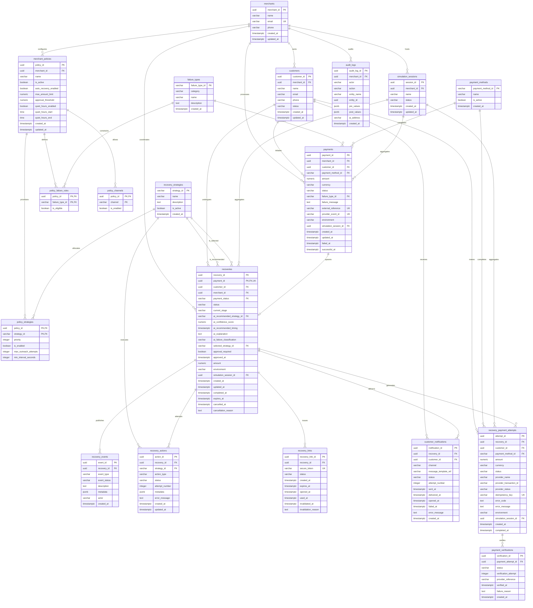

# RecoverAI Entity Relationship Diagram (ERD)

This document provides a visual representation of the RecoverAI relational database schema using Mermaid.js syntax.

```mermaid
erDiagram
    %% Lookups
    payment_methods {
        varchar payment_method_id PK
        varchar name
        boolean is_active
        timestamptz created_at
    }
    failure_types {
        varchar failure_type_id PK
        varchar category
        varchar name
        text description
        timestamptz created_at
    }
    recovery_strategies {
        varchar strategy_id PK
        varchar name
        text description
        boolean is_active
        timestamptz created_at
    }

    %% Core System Entities
    merchants {
        uuid merchant_id PK
        varchar name
        varchar email UK
        varchar phone
        timestamptz created_at
        timestamptz updated_at
    }
    customers {
        uuid customer_id PK
        uuid merchant_id FK
        varchar name
        varchar email
        varchar phone
        varchar status
        timestamptz created_at
        timestamptz updated_at
    }

    %% Policies
    merchant_policies {
        uuid policy_id PK
        uuid merchant_id FK
        varchar name
        boolean is_active
        boolean auto_recovery_enabled
        numeric max_amount_limit
        numeric approval_threshold
        boolean quiet_hours_enabled
        time quiet_hours_start
        time quiet_hours_end
        timestamptz created_at
        timestamptz updated_at
    }
    policy_failure_rules {
        uuid policy_id PK, FK
        varchar failure_type_id PK, FK
        boolean is_eligible
    }
    policy_strategies {
        uuid policy_id PK, FK
        varchar strategy_id PK, FK
        integer priority
        boolean is_enabled
        integer max_outreach_attempts
        integer min_interval_seconds
    }
    policy_channels {
        uuid policy_id PK, FK
        varchar channel PK
        boolean is_enabled
    }

    %% Sandbox
    simulation_sessions {
        uuid session_id PK
        uuid merchant_id FK
        varchar name
        varchar status
        timestamptz created_at
        timestamptz updated_at
    }

    %% Transactions
    payments {
        uuid payment_id PK
        uuid merchant_id FK
        uuid customer_id FK
        varchar payment_method_id FK
        numeric amount
        varchar currency
        varchar status
        varchar failure_type_id FK
        text failure_message
        varchar external_reference UK
        varchar provider_event_id UK
        varchar environment
        uuid simulation_session_id FK
        timestamptz created_at
        timestamptz updated_at
        timestamptz failed_at
        timestamptz successful_at
    }
    recoveries {
        uuid recovery_id PK
        uuid payment_id PK, FK, UK
        uuid customer_id FK
        uuid merchant_id FK
        varchar payment_status FK
        varchar status
        varchar current_stage
        varchar ai_recommended_strategy_id FK
        numeric ai_confidence_score
        timestamptz ai_recommended_timing
        text ai_explanation
        varchar ai_failure_classification
        varchar selected_strategy_id FK
        boolean approval_required
        timestamptz approved_at
        numeric amount
        varchar environment
        uuid simulation_session_id FK
        timestamptz created_at
        timestamptz updated_at
        timestamptz completed_at
        timestamptz expires_at
        timestamptz cancelled_at
        text cancellation_reason
    }

    %% Timeline & Actions
    recovery_events {
        uuid event_id PK
        uuid recovery_id FK
        varchar event_type
        varchar event_status
        text description
        jsonb metadata
        varchar actor
        timestamptz created_at
    }
    recovery_actions {
        uuid action_id PK
        uuid recovery_id FK
        varchar strategy_id FK
        varchar action_type
        varchar status
        integer attempt_number
        jsonb metadata
        text error_message
        timestamptz created_at
        timestamptz updated_at
    }
    recovery_links {
        uuid recovery_link_id PK
        uuid recovery_id FK
        varchar secure_token UK
        varchar status
        timestamptz created_at
        timestamptz expires_at
        timestamptz opened_at
        timestamptz used_at
        timestamptz invalidated_at
        text invalidation_reason
    }
    customer_notifications {
        uuid notification_id PK
        uuid recovery_id FK
        uuid customer_id FK
        varchar channel
        varchar message_template_ref
        varchar status
        integer attempt_number
        timestamptz sent_at
        timestamptz delivered_at
        timestamptz opened_at
        timestamptz failed_at
        text error_message
        timestamptz created_at
    }

    %% Checkout Retry
    recovery_payment_attempts {
        uuid attempt_id PK
        uuid recovery_id FK
        uuid customer_id FK
        varchar payment_method_id FK
        numeric amount
        varchar currency
        varchar status
        varchar provider_name
        varchar provider_transaction_id
        varchar provider_status
        varchar idempotency_key UK
        text error_code
        text error_message
        varchar environment
        uuid simulation_session_id FK
        timestamptz created_at
        timestamptz completed_at
    }
    payment_verifications {
        uuid verification_id PK
        uuid payment_attempt_id FK
        varchar status
        integer verification_attempt
        varchar provider_reference
        timestamptz verified_at
        text failure_reason
        timestamptz created_at
    }

    %% Admin Log
    audit_logs {
        uuid audit_log_id PK
        uuid merchant_id FK
        varchar actor
        varchar action
        varchar entity_name
        uuid entity_id
        jsonb pre_values
        jsonb post_values
        varchar ip_address
        timestamptz created_at
    }

    %% Relationships
    merchants ||--o{ customers : "owns"
    merchants ||--o{ merchant_policies : "configures"
    merchants ||--o{ simulation_sessions : "hosts"
    merchants ||--o{ payments : "processes"
    merchants ||--o{ recoveries : "coordinates"
    merchants ||--o{ audit_logs : "audits"

    customers ||--o{ payments : "initiates"
    customers ||--o{ recoveries : "undergoes"
    customers ||--o{ customer_notifications : "receives"
    customers ||--o{ recovery_payment_attempts : "makes"

    merchant_policies ||--o{ policy_failure_rules : "defines"
    merchant_policies ||--o{ policy_strategies : "prioritizes"
    merchant_policies ||--o{ policy_channels : "allows"

    failure_types ||--o{ policy_failure_rules : "constrains"
    failure_types ||--o{ payments : "classifies"

    recovery_strategies ||--o{ policy_strategies : "allocates"
    recovery_strategies ||--o{ recoveries : "is_recommended"
    recovery_strategies ||--o{ recoveries : "is_selected"
    recovery_strategies ||--o{ recovery_actions : "executes"

    payment_methods ||--o{ payments : "completes"
    payment_methods ||--o{ recovery_payment_attempts : "completes"

    simulation_sessions ||--o{ payments : "aggregates"
    simulation_sessions ||--o{ recoveries : "aggregates"
    simulation_sessions ||--o{ recovery_payment_attempts : "aggregates"

    payments ||--o| recoveries : "spawns"

    recoveries ||--o{ recovery_events : "publishes"
    recoveries ||--o{ recovery_actions : "attempts"
    recoveries ||--o{ recovery_links : "issues"
    recoveries ||--o{ customer_notifications : "delivers"
    recoveries ||--o{ recovery_payment_attempts : "generates"

    recovery_payment_attempts ||--o{ payment_verifications : "verifies"
```
